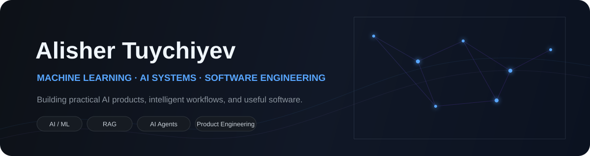
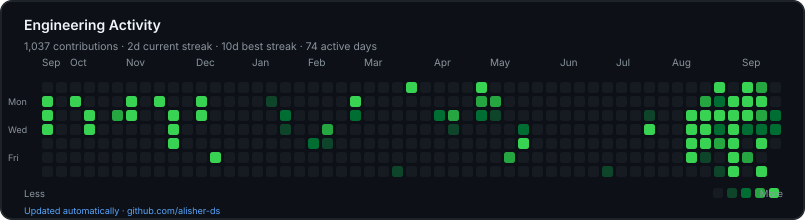

<div align="center">



<br/>

<a href="https://github.com/alisher-ds"></a>
<a href="https://www.linkedin.com/in/alisher-tuychiyev-9aa570349"></a>
<a href="https://t.me/Alisher_Tuychiyev"></a>
<a href="mailto:alishertuuchiyev@gmail.com"></a>

</div>

<br/>

## About

I’m a Machine Learning student focused on **building practical AI systems** — from models and retrieval pipelines to agentic workflows and production-oriented software.

I’m particularly interested in the layer between **AI research and useful products**: designing the system, evaluating it, shipping it, and learning from real usage.

---

## Focus

| | Area | What I work with |
|:--:|:--|:--|
| **01** | **Machine Learning** | Applied ML · Data · Evaluation |
| **02** | **LLM Systems** | RAG · Embeddings · Semantic Search · LLM Applications |
| **03** | **AI Agents** | Research Pipelines · Tool Use · Automation · Workflows |
| **04** | **Software Engineering** | APIs · Web Applications · Cloud Infrastructure · Testing |

---

## Selected Projects

### [TG-BlogPost](https://github.com/alisher-ds/TG-BlogPost) · Agentic Content Automation

A multi-stage AI system that researches topics, generates editorial drafts, performs quality checks, schedules content, and publishes to Telegram with human approval in the loop.

`TypeScript` `Cloudflare Workers` `D1` `Gemini` `AI Agents`

### [Study Mate](https://github.com/alisher-ds/study-mate-bot) · RAG Learning Assistant

A document-based learning assistant built around retrieval: document processing, embeddings, semantic search, contextual retrieval, and LLM-generated answers.

`Python` `ChromaDB` `Sentence Transformers` `Groq`

### [Imkon AI](https://github.com/alisher-ds/imkon-ai) · Opportunity Discovery

A platform for discovering jobs, internships, grants, and learning opportunities, with search and personalized discovery as the core product direction.

`Next.js` `TypeScript` `Supabase` `PostgreSQL`

### [Oydin](https://github.com/alisher-ds/oydin-uz) · Personal Knowledge System

A focused web product for writing, exploring ideas, and organizing personal knowledge with an emphasis on clarity and user experience.

`JavaScript` `Cloudflare` `Testing` `Web`

---

## Stack

<div align="center">


</div>

<br/>

**AI / ML**  ·  Python · scikit-learn · Pandas · NumPy · Sentence Transformers · RAG · Embeddings · LLMs · AI Agents

**Software**  ·  TypeScript · JavaScript · React · Next.js · Vite · Tailwind CSS · APIs

**Infrastructure**  ·  PostgreSQL · Supabase · Cloudflare Workers · D1 · Docker · GitHub Actions

---

## Engineering Approach

```text
Understand the problem
        ↓
Model the system
        ↓
Build the smallest useful version
        ↓
Measure & validate
        ↓
Ship
        ↓
Observe → iterate → improve
```

I value **simple architecture, explicit trade-offs, measurable results, and software that is actually useful**.

---

## Current Direction

```text
Machine Learning
      ↓
Deep Learning
      ↓
RAG & Retrieval
      ↓
LLM Applications
      ↓
AI Agents
      ↓
Production AI Systems
```

Currently focused on turning individual AI techniques into **reliable, end-to-end systems**.

---

## Contribution Activity

<div align="center">



</div>

<br/>

---

<div align="center">

**Build useful things. Ship them. Learn from them.**

<br/><br/>

<a href="https://github.com/alisher-ds">GitHub</a> ·
<a href="https://www.linkedin.com/in/alisher-tuychiyev-9aa570349">LinkedIn</a> ·
<a href="https://t.me/Alisher_Tuychiyev">Telegram</a> ·
<a href="mailto:alishertuuchiyev@gmail.com">Email</a>

<br/><br/>


</div>
