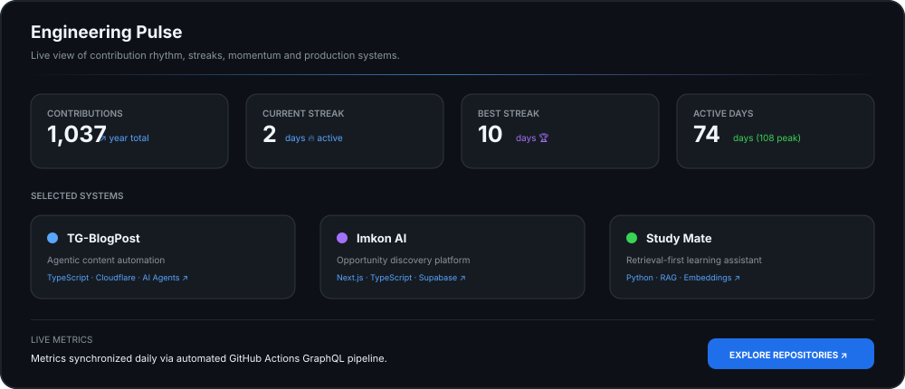

 

## Engineering Activity

Built around real GitHub activity · updated automatically

## Tech Stack

<strong>Full breakdown</strong>

 

`Python` · `TypeScript` · `JavaScript` · `React` · `Next.js` · `Tailwind CSS` · `FastAPI` · `Aiogram` · `PostgreSQL` · `Supabase` · `Cloudflare` · `Docker` · `GitHub Actions` · `RAG` · `Vector Search` · `LLM Agents`

## Repositories

| Repository | What it is | Stack |
|:---|:---|:---|
| [**TG-BlogPost**](https://github.com/alisher-ds/TG-BlogPost) | Agentic Telegram content automation | TypeScript · Cloudflare · AI Agents |
| [**Imkon AI**](https://github.com/alisher-ds/imkon-ai) | Opportunity discovery platform | Next.js · TypeScript · Supabase |
| [**Oydin**](https://github.com/alisher-ds/oydin-uz) | Visual workspace for mapping ideas | JavaScript · Cloudflare · AI |
| [**Study Mate Bot**](https://github.com/alisher-ds/study-mate-bot) | RAG-based learning assistant | Python · RAG · Embeddings |
| [**EduBot MiniApp**](https://github.com/alisher-ds/edubot-miniapp) | Telegram educational mini app | JavaScript · Telegram · AI |
| [**EduBot Pro**](https://github.com/alisher-ds/edubot-pro) | Educational AI project | Python · AI |
| [**Startup Tahlilchi**](https://github.com/alisher-ds/Startup-tahlilchi) | AI-assisted startup analysis | Python · AI |

## Contribution Activity

Contribution activity · refreshed automatically

<!-- Automated profile sync & metrics powered by GitHub Actions GraphQL pipeline -->

---

<a href="https://github.com/alisher-ds">GitHub</a> ·
<a href="https://www.linkedin.com/in/alisher-tuychiyev-9aa570349">LinkedIn</a> ·
<a href="https://t.me/Alisher_Tuychiyev">Telegram</a> ·
<a href="mailto:alishertuuchiyev@gmail.com">Email</a> ·
<a href="https://alisher-portfolio-showcase.lovable.app">Portfolio</a>

